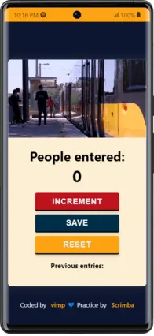
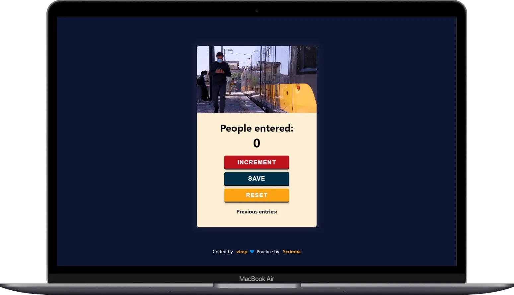

# Passenger Counter App
This is a practice of the ["Learn JavaScript"](https://scrimba.com/learn/learnjavascript) course by [Scrimba](https://scrimba.com/).

It consists of building a passenger counter app.

📱 Mobile

💻 Desktop

## Link

✨ Want to have a look?, [click here](https://mendez-v.github.io/counter-app/) 👀

## Recursos

🎞 Video by [Sofia](https://www.pexels.com/video/metro-train-in-city-12096369/) on [Pexels](https://www.pexels.com/)

🖼 Favicon [Stopwatch](https://iconscout.com/icons/stopwatch) by [IconMark](https://iconscout.com/contributors/mark-aventura) on [IconScout](https://iconscout.com)
